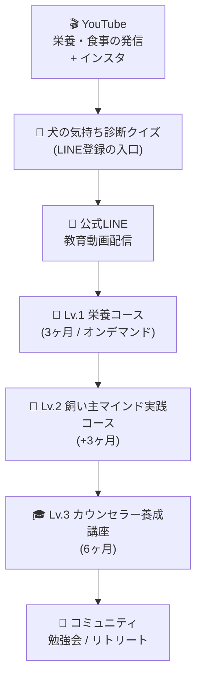

# きいちゃん ビジネスモデル設計書（Draft v1）

> **ベース情報**: 初回セッション 2026年3月17日の会話メモ
> **コンサルタント**: 野村光恵
> **ステータス**: 初版まとめ ― フィードバック待ち

---

## 1. プロフィール＆現在地

| 項目 | 内容 |
|------|------|
| **年齢** | 50歳（2026年時点） |
| **現業** | ペットショップ経営（2026年4月26日閉店予定）＋オンライン物販（売り切り終了） |
| **肩書き** | 栄養と心理のトレーナー |
| **資格** | 管理栄養士 / ペット栄養管理士 / 栄養心理カウンセラー（TNT） |
| **学歴** | 分子栄養学臨床研究会 所属 / 米・南イリノイ大学 犬猫栄養講座修了（3ヶ月） |
| **技術スキル** | LP制作 / Canva画像編集 / WordPress運用 / YouTube運営経験 |
| **教育実績** | 栄養講座 累計1,000名受講 |
| **性格診断** | 16Personalities: ENTJ（指揮者型）/ 自己犠牲型の傾向あり |

---

## 2. 原体験 ― ビジネスの核心

### 🐾 愛犬の危機から得た確信

1. **犬の腎臓悪化** → 従来のセオリーではなく分子栄養学ベースの食事に変更 → 数値が劇的改善
2. **犬の急性炎症（生死の危機）** → 飼い主として「犬への執着・依存」を手放し、気持ちを切り離した瞬間 → 犬が自力で水を飲み、劇的回復

> **核心的信念**: 「飼い主のマインドが犬の健康に直結する」
> 
> これは単なるエピソードではなく、きいちゃんのビジネス全体を貫く**原理**。栄養だけでは頭打ちになる人がいるのは、「病気をするメリット」を心理的に抱えているため。

---

## 3. 強みの5本柱

| # | 強み | 詳細 |
|---|------|------|
| ① | **圧倒的な専門性** | 管理栄養士 × 分子栄養学 × 南イリノイ大学修了 × ペット栄養管理士 × 栄養心理カウンセラー |
| ② | **実体験に基づく確信** | 自分の犬で「飼い主マインド → 犬の回復」を2度証明した原体験 |
| ③ | **情報収集＆発信のエネルギー** | 学会情報・最新論文を追い続け、「聞いて聞いて！」と伝えることに喜びを感じる |
| ④ | **制作・ITスキル** | LP制作・Canva・WordPress・YouTube → 外注なしで自走可能 |
| ⑤ | **教育実績** | 栄養講座累計1,000名受講の実績 |

---

## 4. 乗り越えるべき壁（ブロック）

| 壁 | 解消の方向性 |
|----|------------|
| 「命に関わること。自分の発言で後悔に変わったら…」 | **「決めるのはあなた自身」というスタンス**を明示。中を見るお手伝いという立ち位置 |
| 知識が豊富すぎて「注射器でひな鳥に餌をやる」状態になりがち | **一口サイズに分解する仕組み**（階段型コンテンツ設計）が必要 |
| ブランドが分散（犬の腸活アカデミー / ANP / 個別相談） | **統一コンセプト名**を1つ作り、ブランドを集約 |
| コミュニティの「お世話」が得意ではない | **運営パートナー**を見つけて組む（表＝きいちゃん、裏方＝お世話好きな人） |

---

## 5. 競合分析＆ポジショニング

### 5-1. 主要プレイヤー

| プレイヤー | 特徴 | 価格帯 | 弱み（きいちゃん視点） |
|-----------|------|--------|---------------------|
| **飯村かおり** | 飼い主軸カウンセラー / NLP / インスタ集客 / 養成講座を展開 | 不明（電話→面談型） | 栄養の科学的根拠が弱い。心理の背景はNLP（浅い可能性）。見せ方がうまい |
| **サニーズ（獣医師）** | 根本治療アプローチ / 飼い主マインド到達 | ¥100万〜 | 獣医の権威性依存。価格が高い |
| **犬猫の食と自然医療の学校** | 東洋医学寄りの食事療法 / インストラクター認定 | 不明 | 必要な栄養素が不足する事例あり。東洋医療偏重 |

### 5-2. ポジショニングマップ

```
              心理・マインド重視
                    ↑
                    |
        飯村かおり  |  ★きいちゃん
        (NLP+養生)  |  (科学+心理+実体験)
                    |
                    |     サニーズ
                    |     (獣医¥100万〜)
  東洋医学 ←———————+————————→ 西洋科学
                    |
        犬猫の食と   |
        自然医療の学校|
        (食事療法のみ)|
                    |
              栄養・食事重視
```

> [!IMPORTANT]
> **きいちゃんだけのポジション**:「西洋科学の根拠」×「飼い主マインド」の交差点。
> この交差点に立てるのは、分子栄養学の専門性と飼い主マインドの実体験を持つきいちゃんだけ。

---

## 6. ビジネスモデル全体像

### 6-1. コンセプト

**「犬の不調の答えは、飼い主の内側にある」**

- 入り口: ワンちゃんの食事・栄養の悩み（一般的なニーズ）
- 中間: 正しい栄養知識＋フード選びの自立
- 核心: 飼い主マインドの変容 → 犬の健康改善 → 飼い主自身の人生変容

### 6-2. ファネル設計



### 6-3. 各階段の詳細

#### 🧩 入口：犬の気持ち診断クイズ（無料 → LINE登録）

| 項目 | 内容 |
|------|------|
| **目的** | LINE登録＋常識破壊（「知らなかった！」を作る） |
| **形式** | 3〜5択のクイズ形式 |
| **設計思想** | ①興味喚起 → ②「えっ知らなかった」 → ③専門家としての信頼 → ④もっと知りたい |
| **問題例** | 「犬は何時間寝る？」（正解: 浅い90分サイクルの繰り返し）、「夜最後のご飯と朝ご飯の間隔は？」（8〜10時間空ける） |
| **ポイント** | 回答の中に**飼い主マインド**をにおわせる → 「外側の問題じゃなく、内側にあった」への気づき |

#### 📱 公式LINE（教育動画）

| 項目 | 内容 |
|------|------|
| **目的** | 信頼構築＋飼い主マインドの重要性の教育 |
| **形式** | 短い動画を数本配信（長いステップメールではなく、動画重視） |
| **流れ** | ①犬の不調の根本原因は飼い主マインド → ②どういうことか具体例 → ③もっと学びたい方は講座へ |

#### 📖 Lv.1：栄養コース（3ヶ月 / オンデマンド）

| 項目 | 内容 |
|------|------|
| **対象** | フード選びに悩む飼い主 |
| **ゴール** | 自分でフードを選べるようになる |
| **形式** | オンデマンド動画 + 定期Q&A（オンライン） |
| **コンテンツ** | フード選びの基礎 / 血糖値とフードの関係 / 原材料の見方 / アレルギー対策 / 手作りご飯の基本 |
| **既存資産** | 旧・栄養講座（1,000名受講）をリニューアル・再設計 |

#### 💎 Lv.2：飼い主マインド実践コース（+3ヶ月）

| 項目 | 内容 |
|------|------|
| **対象** | Lv.1修了者 or 栄養だけでは行き詰まった飼い主 |
| **ゴール** | 飼い主マインドの変容 → 犬の健康改善＋飼い主自身の人生変容 |
| **形式** | 伴走型（個別 or 少人数グループ） |
| **コンテンツ** | 飼い主マインドの原理 / 依存・執着の手放し / 日常のストレスケア / 飼い主自身の思考パターンワーク |
| **差別化** | 思考の学校の学びを犬の飼い主向けにカスタマイズ |

#### 🎓 Lv.3：カウンセラー養成講座（6ヶ月）

| 項目 | 内容 |
|------|------|
| **対象** | Lv.2修了者で「自分も教える側に回りたい」人 |
| **ゴール** | 飼い主マインドカウンセラーとして活動できるようになる |
| **形式** | ゼロ期5名 → 1期10名 |
| **認定制度** | オンライン資格試験の導入を検討（アロマアドバイザー型） |
| **投資回収の設計** | 「学んだだけでなく、仕事にもなる」という訴求 |

#### 🌴 コミュニティ

| 項目 | 内容 |
|------|------|
| **規模** | 講師陣30名（3年後目標）+ 一般飼い主 |
| **活動** | 定期勉強会 / 沖縄リトリート（15〜20名） / ゲスト講師（思考の学校の先生方） |
| **運営** | きいちゃん = 表（発信・学び提供）、パートナー = 裏方（お世話・コミュニティ管理） |

### 6-4. 収益構造（仮説）

| 収益源 | 単価（仮） | 年間人数 | 年間売上（仮） |
|--------|----------|---------|-------------|
| Lv.1 栄養コース | ¥30,000〜50,000 | 50〜100名 | ¥150万〜500万 |
| Lv.2 飼い主マインドコース | ¥150,000〜300,000 | 15〜30名 | ¥225万〜900万 |
| Lv.3 養成講座 | ¥300,000〜500,000 | 5〜10名 | ¥150万〜500万 |
| コミュニティ月額 | ¥5,000〜10,000 | 30名 | ¥180万〜360万 |
| **合計** | | | **¥705万〜2,260万** |

> [!NOTE]
> 価格は未定。セッション内では具体的な価格設定は議論されていない。
> 競合参考: サニーズ ¥100万、飯村かおり 不明（審査制・電話クロージング）

---

## 7. マーケティング戦略

### 7-1. チャネル戦略

| チャネル | 優先度 | 用途 |
|---------|--------|------|
| **YouTube** | ★★★ 最優先 | 認知拡大・信頼構築・教育。きいちゃんの情報発信エネルギーと相性◎ |
| **Instagram** | ★★ 併用推奨 | ワンちゃん写真との相性◎。SNSの補完チャネル |
| **公式LINE** | ★★★ 基盤 | 教育動画配信・講座案内の導線 |
| **犬の気持ち診断クイズ** | ★★★ 集客装置 | LINE登録の入口。常識破壊＋専門性アピール |

### 7-2. コンテンツ戦略

| テーマ | 具体例 | 目的 |
|--------|--------|------|
| **常識破壊系** | 犬の睡眠の真実 / お散歩の正しいやり方 / 空腹時の対処法 | 興味喚起・専門性証明 |
| **フード選び** | フードの見分け方 / ダイエットフードの選び方 | 最もニーズが高い入口テーマ |
| **最新情報** | 学会発表・論文紹介 / 栄養基準の変更 | きいちゃんのエネルギー源。差別化 |
| **飼い主マインド** | ワンちゃんの不調と飼い主の心の関係 | 本命テーマへの橋渡し |

### 7-3. 成功のキー要因

> きいちゃんの成功ポイントは「影響力ある人からの推薦」。
> ワンちゃんの飼い主でクライアントになり、結果的に救われた人が
> 「本当にこれ、みんなに知ってほしい」と広めてくれる流れ。
> → その時にYouTube・コンテンツ基盤が整っていれば、一気に拡大可能。

---

## 8. ３年ロードマップ

### Phase 1：準備期間（2026年3〜4月）

- [x] 初回コンサルセッション（3/17 完了）
- [ ] ストレングスファインダー診断を受ける
- [ ] 強み開発セッション（4月上旬）
- [ ] ペットショップ閉店（4/26）

### Phase 2：基盤構築（2026年5〜6月）

- [ ] 統一ブランド名の決定
- [ ] YouTube再開（認知拡大＆信頼構築）
- [ ] 犬の気持ち診断クイズ 設計＆公開（LINE登録入口）
- [ ] 公式LINE構築
- [ ] Lv.1講座リニューアル

### Phase 3：コンテンツ確立（2026年7〜9月）

- [ ] Lv.2 飼い主マインド実践コース 設計
- [ ] Lv.1講座を2〜3回実施（声を集める）
- [ ] ビフォーアフター収集 + Lv.2教材完成

### Phase 4：ゼロ期 → 1期（2026年9月〜2027年3月）

- [ ] **ゼロ期開始**（5名｜知人＋α｜特別価格）
- [ ] 中間振り返り（12月）
- [ ] **ゼロ期修了 + 1期募集開始**（2月）
- [ ] **1期スタート**（10名）（3月）

### Phase 5：拡大＆コミュニティ化（2027年〜2029年）

- [ ] 養成講座（Lv.3）本格スタート
- [ ] コミュニティ構築（講師陣30名目標）
- [ ] 沖縄リトリート開催（15〜20名規模）
- [ ] ゲスト講師招聘（思考の学校の先生方）
- [ ] 運営パートナーの確保
- [ ] 労働時間を最小化、安定収入の確立

---

## 9. 次回セッションで深めたいこと

> [!IMPORTANT]
> ### きいちゃん側のアクション
> - ストレングスファインダー診断の受検
> - ゼロ期候補2名への軽い声かけ
> - 事業の流れを自分なりに整理
> - ブランド名の候補を3つ考える

### 野村側で準備すること
- ストレングスファインダー結果の読み解き＆成功パターンの紐付け
- 具体的なサポート体制・料金体系の提案
- 犬の気持ち診断クイズの設計案
- YouTube再開に向けたコンテンツ計画の叩き台

---

## 10. セッションから抽出したキーワード

| きいちゃん自身の言葉 | 意味・示唆 |
|---------------------|-----------|
| 「仕事の満足が自分の満足にイコール」 | 仕事＝自己実現。ワークライフバランスではなく一体型 |
| 「人生ってすごい素晴らしい。可能性に立ち会いたい」 | ミッション＝人の可能性の覚醒に立ち会うこと |
| 「少人数でいい。お互いのことが分かっていく関係性」 | 大規模スクールではなく、深い関係性のコミュニティ |
| 「お世話はそんなに得意じゃない」 | 運営パートナーが必要。発信・教育に集中すべき |
| 「新しい知識があったら"聞いて聞いて"ってなる」 | 情報発信がエネルギー源。YouTubeとの相性◎ |
| 「知りたい飼い主さん、いっぱいいるんじゃないかな」 | ニーズの確信は持っている。あとは届け方 |
