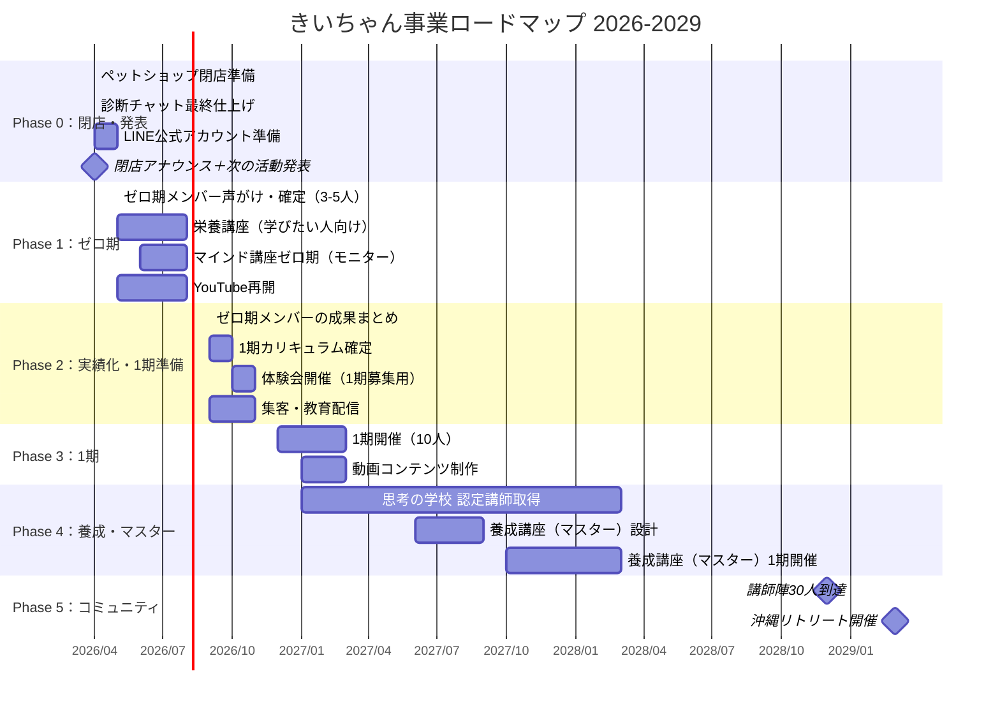

# 🌻 きいちゃん 事業ロードマップ
> MTG（3/17 + 4/7）で話した期間を元に作成
> 
> **基準日**: 2026年3月17日（初回セッション）
> **今日**: 2026年4月11日

---

## 📊 全体タイムライン



---

## 🗓️ フェーズ別の詳細

### Phase 0：閉店・発表（〜2026年4月末）
> **目標**: ペットショップ→新事業への移行をスムーズに完了

| 週 | やること | 担当 | ステータス |
|----|---------|------|----------|
| 4/11〜 | 診断チャットの仕上げ（ヒアリングシート回収後） | 野村 | 🔄 進行中 |
| 4/11〜 | ヒアリングシートを埋める | きいちゃん | ⬜ 未着手 |
| 4/14〜 | LINE公式アカウント準備 | きいちゃん+野村 | ⬜ 未着手 |
| 4/21〜 | 閉店アナウンス文の作成 | きいちゃん+野村 | ⬜ 未着手 |
| **4/26** | **🏪 ペットショップ閉店** | — | — |
| 4/26〜 | 閉店アナウンス + 新活動案内 + LINE誘導 | きいちゃん | ⬜ 未着手 |

**判断ポイント**:
- [ ] 診断チャットのURL → 閉店アナウンスに入れる？
- [ ] LINE登録特典 → 動画？PDF？

---

### Phase 1：ゼロ期（2026年5月〜8月）
> **目標**: 3〜5人のモニターで実績を作る（コンテンツはやりながら磨く）

| 月 | やること | 備考 |
|----|---------|------|
| **5月** | ゼロ期メンバー確定＋個別声がけ | すでに2名前向き。残り1〜3名 |
| **5月** | 栄養講座スタート（学びたい人向け） | 動画コンテンツの素材にもなる |
| **5月** | YouTube再開（週1投稿目標） | 飼い主マインド系の入口動画 |
| **6月** | マインド講座ゼロ期スタート | 月2回 × 3ヶ月 = 6回構成 |
| **6〜8月** | 個別対応しながらコンテンツを磨く | ビフォーアフター記録 |
| **8月** | ゼロ期終了・成果まとめ | 実績ストーリー化 |

**きいちゃんの声がけスクリプト案**（4/7セッションのスタイルに合わせて）:
> 「今度こういうのやるんやけど、興味あったら受けてみない？」
> → 個別で説明 → 決めてもらう（きいちゃんの個別化で最も強いパターン）

**ゼロ期の価格設定**:
> [!WARNING]
> ゼロ期は通常価格より大幅に下げるのが一般的。一緒に作っていく「共創」メンバーとして巻き込む形。
> きいちゃんに確認：価格帯のイメージは？

---

### Phase 2：実績化・1期準備（2026年9月〜11月）
> **目標**: ゼロ期の成果をもとに1期を設計・集客

| 月 | やること | 備考 |
|----|---------|------|
| **9月** | ゼロ期メンバーの声・ビフォーアフターまとめ | LP・動画素材に |
| **9月** | 1期のカリキュラム確定 | ゼロ期での学びを反映 |
| **10月** | 体験会開催（1〜2回） | LINE登録者への案内 |
| **11月** | 1期の募集・個別相談 | 10人目標 |

**ファネルの流れ（この時点で稼働するもの）**:

```
YouTube（週1） → 診断チャット → LINE登録
                                    ↓
                            教育配信（4通）
                                    ↓
                            体験会のご案内
                                    ↓
                            個別相談 → 1期申込
```

---

### Phase 3：1期開催（2026年12月〜2027年3月）
> **目標**: 10人の受講生で成果を出す + 動画コンテンツ化

| 月 | やること | 備考 |
|----|---------|------|
| **12月** | 1期スタート | 月2回 × 4ヶ月 想定 |
| **1月** | 動画コンテンツ制作開始 | 講座の一部を撮影 |
| **2月** | ゼロ期メンバーがサポート参加 | 講師候補の育成 |
| **3月** | 1期終了・実績まとめ | 2期/養成講座への布石 |

> [!TIP]
> 3/17セッションできいちゃんが言った：「1年後（2027年3月）にはゼロ期を終えて1期ぐらいにはしておきたい」→ ちょうどこのスケジュールで1期が終了。

---

### Phase 4：養成講座・マスター（2027年〜）
> **目標**: 「教えられる人」を育てる

| 期間 | やること | 備考 |
|------|---------|------|
| 2027年前半 | 思考の学校 認定講師 受験・取得 | 約2年かかる見込み→前倒しで受験 |
| 2027年後半 | 養成講座（マスター）設計 | 栄養 + マインド統合講座 |
| 2027年秋 | マスター1期開催（5〜10人） | ゼロ期・1期メンバーも対象 |
| 2028年〜 | マスター継続開催 | 各期5〜10人 |

**きいちゃんの言葉**（4/7セッション）:
> 「カウンセリングでもコーチングでもなく、**トレーニング**っていう感覚。飼い主さんのマインドを一緒にトレーニングするトレーナーという感じ」

---

### Phase 5：コミュニティ・リトリート（2028年〜2029年）
> **目標**: 講師30人、沖縄リトリート

| 期間 | やること | 備考 |
|------|---------|------|
| 2028年 | 講師陣20〜30人到達 | 各期5〜10人 × 数期 |
| 2028年秋 | 初のリトリート企画 | 15〜20人規模 |
| 2029年春 | **🌺 沖縄リトリート開催** | 思考の学校の先生をゲストに |

**3年後のビジョン**（3/17セッション）:
> - 30人の講師陣 → 定期的な勉強会
> - 沖縄リトリート → 15〜20人規模
> - 思考の学校の先生方をゲスト講師に
> - 働く時間は少なく、安定収入

---

## 💰 収益モデル（概算）

| 商品 | 想定価格 | 人数/期 | 年間収益イメージ |
|------|---------|--------|---------------|
| 栄養講座（学びたい人向け） | 3〜5万円 | 10〜20人/年 | 30〜100万 |
| 飼い主マインド講座（メイン） | 15〜30万円 | 10人/期×2回 | 300〜600万 |
| 養成講座（マスター） | 50〜100万円 | 5〜10人/期 | 250〜1,000万 |
| 動画コンテンツ販売 | 1〜3万円 | 月10〜30本 | 120〜360万 |

> [!IMPORTANT]
> 価格は競合参考値（飯村さん＝養成講座あり / サニーズ＝100万の個別）。きいちゃんと要相談。

---

## ⚡ 直近のネクストアクション（今週〜来週）

| # | アクション | 誰が | いつまで |
|---|-----------|------|--------|
| 1 | **ヒアリングシートを埋める** | きいちゃん | 4/18(金) |
| 2 | ヒアリング回収後、診断チャット最終仕上げ | 野村 | 4/21(月) |
| 3 | LINE公式アカウント開設 or 確認 | きいちゃん | 4/18(金) |
| 4 | 閉店アナウンス文のドラフト | きいちゃん+野村 | 4/21(月) |
| 5 | ゼロ期候補者への声がけ（個別） | きいちゃん | 4月末まで |
| 6 | YouTube再開の第1本目テーマ決め | きいちゃん | 5月初旬 |

---

> **📝 このロードマップは生きたドキュメントです。次回MTGで期間と価格を確定し、更新します。**
