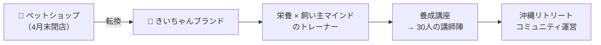
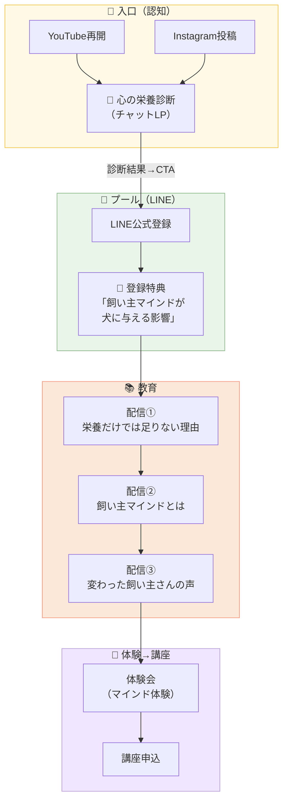

# 🌻 きいちゃん 事業プロセス設計書
> 2回のMTG（3/17初回 + 4/7 ストレングスセッション）を統合

---

## 🎯 全体ビジョン



### タイムライン

| 期間 | マイルストーン | 人数規模 |
|------|-------------|---------|
| **2026年4月末** | ペットショップ閉店・活動転換を発表 | — |
| **2026年5〜6月** | ゼロ期開催（モニター） | 3〜5人 |
| **2026年秋〜冬** | 1期講座開催 | 10人 |
| **2027年〜** | 養成講座（マスター）開始 | 5〜10人/期 |
| **2028年〜** | 講師陣30人・リトリート開催 | 15〜20人参加 |

---

## 💡 きいちゃんのストレングスと事業の相性

| TOP資質 | 事業での活かし方 |
|--------|---------------|
| 1. **活発性** | 決めたら即行動。ゼロ期もまず動いてから整える |
| 2. **運命志向** | 「すべてに意味がある」→ 原体験ストーリーの説得力 |
| 3. **学習欲** | 分子栄養学＋思考の学校、常にインプットし続ける |
| 4. **着想** | 既存の常識を壊す新しいアイデア（栄養×マインド融合） |
| 5. **内省** | 深く考えてから発信 → コンテンツの質の高さ |
| 6. **自我** | 「世の中にインパクトを残したい」→ 養成講座の原動力 |
| 8. **ポジティブ** | 熱量で周りを巻き込む → ゼロ期のメンバーが自走する |
| 9. **個別化** | 一人一人に合わせた対応 → 少人数制の強み |

> [!IMPORTANT]
> **きいちゃんの勝ちパターン**: アイデアが浮かぶ → 即行動 → ボスを先に抑える → 周りに発表 → みんなが笑い合える状態を作る
> 
> **事業に当てはめると**: 新しい知識をインプット → 講座に即反映 → まず2-3人に声がけ → 一緒に成果を出す → その実績で次を広げる

---

## 🔀 ファネル設計（全体フロー）



---

## 📦 商品ラインナップ

### 1️⃣ 栄養講座（学びたい人向け）
- **対象**: 自分の犬のケアだけ知りたい飼い主さん
- **形式**: オンライン / 3〜6ヶ月
- **候補**: すでに2名が前向き
- **将来**: 動画コンテンツ販売に転換

### 2️⃣ 飼い主マインド講座（メインプロダクト）
- **対象**: 栄養だけで行き詰まった飼い主さん
- **核心テーゼ**: 「フードだけ変えてもダメ」→ 飼い主のマインドが犬に直結
- **形式**: オンライン / 月1〜2回 / 3ヶ月コース
- **ゼロ期**: 3〜5人のモニター

### 3️⃣ 養成講座（マスター）← 最終ゴール
- **対象**: 自分も教えたい人
- **条件**: 思考の学校 認定講師 取得後が理想
- **期間**: 1年〜（認定講師取得に約2年の見込み）
- **先行対応**: 「思考の学校」の認定講師を名乗れなくても、オリジナルコンテンツとして先行開催は可能

> [!WARNING]
> **判断ポイント**: 思考の学校のコンテンツをどこまで使えるか要確認。認定講師の肩書なしで始めるなら、完全オリジナルとして設計する必要あり。

---

## 📅 直近90日のアクションプラン

### Phase 1: 閉店 & 発表（〜4月末）

- [ ] ペットショップの在庫整理・閉店準備
- [ ] **閉店アナウンス文の作成**
  - 「今までありがとうございました」
  - 「今後の活動はこちらです」→ LINE誘導
- [ ] **心の栄養診断の最終仕上げ**
  - きいちゃんの口調・専門知識を反映（ヒアリングシート回収後）
  - LINE公式アカウントとの連携
- [ ] **LINE公式アカウント準備**
  - 登録特典の作成
  - 自動配信ステップの設計

### Phase 2: ゼロ期準備（5月）

- [ ] **ゼロ期メンバー確定**（3〜5人）
  - すでに声がけ済み2名の最終確認
  - 追加1〜3名の募集（既存顧客 or 体験会から）
- [ ] **講座コンテンツの骨組み作成**
  - 栄養パート（きいちゃんの既存知識で即対応可能）
  - マインドパート（思考の学校の要素 + オリジナル）
- [ ] **YouTube再開の準備**
  - テーマ選定：「飼い主マインド」系の入口動画
  - 診断チャットへの誘導を各動画に設置

### Phase 3: ゼロ期開催（6月〜8月）

- [ ] **モニター講座開催**（月2回 × 3ヶ月 想定）
- [ ] **個別対応で実績づくり**
  - 各メンバーのビフォーアフター記録
  - 成功事例のストーリー化
- [ ] **コンテンツの磨き上げ**
  - ゼロ期の反応をもとに改善
  - 1期に向けたカリキュラム確定

---

## 🐾 診断チャットの設計思想（現在のプロトタイプ）

### フロー構造

```
┌───────────────┐
│   自己紹介     │ ← きいちゃんの専門性提示
│   名前入力     │
│   犬の名前     │
└───────┬───────┘
        ▼
┌───────────────┐
│  チェック×5    │ ← サクッとテンポよく
│  (承認のみ)    │    方向性だけ見せる
└───────┬───────┘
        ▼
┌───────────────┐
│  結果表示      │ ← バーチャート
│  「わかった？」│
└───────┬───────┘
        ▼
╔═══════════════╗
║  常識破壊      ║ ← 「全部やってもダメな子がいる」
║  「何が違う？」 ║    3択クイズで飼い主マインドに誘導
╚═══════┬═══════╝
        ▼
┌───────────────┐
│  原体験       │ ← きいちゃんの犬の話
│  ストーリー    │   「切り離した瞬間、回復した」
└───────┬───────┘
        ▼
┌───────────────┐
│   CTA         │ ← LINE登録
│  「栄養×マインド│    特典プレゼント
│   の資料」     │
└───────────────┘
```

> [!TIP]
> **atoreno-chat型**: 診断パートは軽く・テンポよく → 結果で「方向性」だけ見せる → ストーリーで「常識破壊」 → LINE特典で回収  
> 知識の出し所は「LINE登録後の教育配信」に集約。診断では出さない。

---

## ❓ きいちゃんに確認したいこと

1. **ゼロ期の開始時期**: 5月 or 6月？（4月末閉店後、すぐ始める？少し準備期間置く？）
2. **栄養とマインド、別講座？一体型？**: 「学びたい人」と「教えたい人」でコースを分ける？
3. **思考の学校のコンテンツ利用**: 認定講師になる前でも、エッセンスをオリジナル講座に入れてOK？
4. **体験会の形式**: オンライン？リアル？少人数個別？
5. **YouTube再開のタイミング**: 閉店と同時？ゼロ期前？ゼロ期中？

---

> **📝 このプロセス設計書 + ヒアリングシートの回答があれば、診断チャットの最終仕上げ＆ LINE連携まで一気に進められます。**
