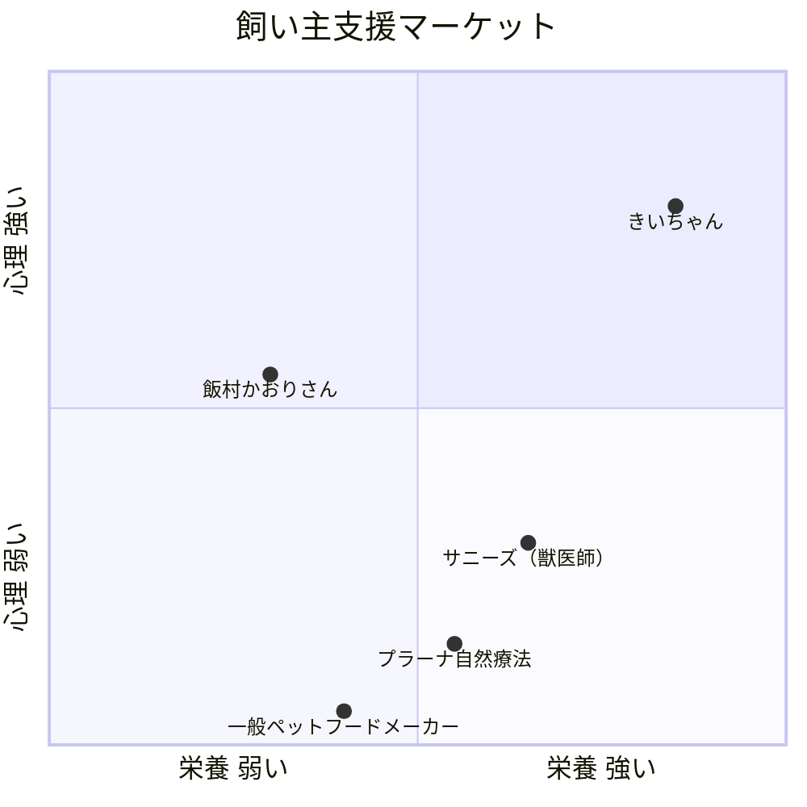

# 🐾 きいちゃんの「飼い主マインド」概念整理
> セッション（3/17 + 4/7）から、きいちゃんが実際に語った内容を抽出・構造化

---

## 🎯 核心テーゼ（きいちゃん自身の言葉）

> 「栄養だけだったら、頭打ちになる人が多い。病気をするメリットを抱えている人っていうのは、栄養のフォローを入れても伸びない。健康度が高まらない」
> — 3/17セッション

> 「私のマインドがその時に…犬に依存していたとか、向き合わなければいけない問題から自分が逃げていたとか、そういう時とかぶっていて」
> — 3/17セッション

> 「これ執着やなって思った。心配とか不安とかいうの、もっと下（上）なんですよ。受容。受け入れること。私にそれが起これば、変わるはずだと思って、意識的に離したんですよ」
> — 3/17セッション

---

## 📐 4つの柱（セッションから抽出）

### 柱① 「病気をするメリット」
**出典**: 3/17 [line 110]

きいちゃんの発見：
- 思考の学校的に言うと、**病気をするメリットを抱えている人**は栄養フォローしても伸びない
- 目的を見つめる → ネガティブを見つめる → ネガティブを変換する
- 飼い主自身が「向き合うべき問題から逃げている」時に、犬が病気になることがある

> [!IMPORTANT]
> **これが飯村さんとの最大の差別化ポイント**。きいちゃんは「病気のメリット」を見る心理アプローチ + 分子栄養学の両方を持っている。

---

### 柱② 「犬への依存と切り離し」
**出典**: 3/17 [line 134, 155, 158, 164]

きいちゃんの原体験の核心：
- 犬が急性の炎症で生死の境に → パニック → 片時も離れられない
- 「心配のエネルギー」をずっと注いでいた
- **気づき**：「これは執着やな」→「この子はこの子の人生だから、死ぬ時も決めて生まれてきたはず」
- **行動**：犬から気持ちを切り離し、普段通りの生活に戻した
- **結果**：犬が自分で水を飲みに行き、劇的回復

> きいちゃんの言葉：
> 「もう私は普段どおりお掃除したりとか、お茶碗を洗ったりとか、自分の体に健康的な食事をとったりとかっていうふうにしようっていうふうに気持ちを切り替えたらね、自分で水を飲みに行き出して、そこからちょっとずつ回復していったんですよ」

---

### 柱③ 「人の心が犬に影響する科学的根拠」
**出典**: 3/17 [line 140, 932]

きいちゃんが見つけた裏付け：
- あちこちで「飼い主さんの健康がワンちゃんに引き継がれてるよ」と点在
- **論文が出ている**（きいちゃん自身が常に探している）
- 「人のマインドが犬に影響するっていうところも、やっぱり探すと論文が出てくる。ほら、ほら、ちゃんと裏付け取れたでしょうっていう気持ちになって」

> [!TIP]
> きいちゃんは学習欲（3位）＋収集心（7位）で常に最新の論文を集めている。**これを言いたくてしょうがない**のが一番のエネルギー源。

---

### 柱④ 「栄養×マインドの融合」
**出典**: 3/17 [line 143, 233, 503], 4/7 [line 619-622]

きいちゃんの到達点：
- 「ちょうど思考の学校っていうのもあるし、私自身も家のことで向き合わないといけないという段階に来たから、これって融合できるんじゃないか」
- 「ワンちゃんの健康とか栄養の相談って、入り口なんですよ。それを介して、結局向き合わないといけないのは、飼い主さん自分自身のこと」
- 「同じなんですよ。その飼い主さんのマインドを変えるっていうところに行き着くんですよ」

4/7セッションでの補足：
- 「カウンセリングでもコーチングでもなく、**トレーニング**っていう感覚。飼い主さんのマインドを一緒にトレーニングする。トレーナーという感じ」

---

## 🔬 具体的な知識ストック（診断・教育コンテンツの種）

### ごはん関連
| テーマ | きいちゃんの知見 | 出典 |
|--------|---------------|------|
| 空腹時間の重要性 | 黄色い液を吐く犬 → 獣医は「こまめにあげて」と言うが、分子栄養学では**空腹時間を作って腸を修復させることが大事** | 3/17 L407 |
| 手作りごはん | 腎臓悪化時に従来のセオリーを無視し手作りに変更→数値が改善 | 3/17 L131 |
| 東洋医学のリスク | 自然療法系の食事で必要な栄養が足りず逆に体調を崩す子がいる | 3/17 L338-344 |
| アメリカの栄養基準 | 2026年1月にアメリカで人の栄養基準が大きく変わった → 犬も変わる | 3/17 L926 |

### ストレスケア関連
| テーマ | きいちゃんの知見 | 出典 |
|--------|---------------|------|
| お散歩 | 匂い嗅がせてる？引っ張ってない？行き先はワンちゃんに決めてもらってる？ | 3/17 L389 |
| 環境 | 夜は照明を落として+音を下げる。しっかり空腹時間を夜に作る | 3/17 L386 |
| 簡単ケア | お金がかからず毎日できる簡単なケアがたくさんある。でもみんな「バカにしてやらない」 | 3/17 L377 |

### 飼い主マインド関連
| テーマ | きいちゃんの知見 | 出典 |
|--------|---------------|------|
| 病気のメリット | 病気をするメリットを抱えている飼い主は、栄養ケアしても犬が良くならない | 3/17 L110 |
| 依存→切り離し | 犬に依存していた＋向き合うべき問題から逃げていた → 切り離したら犬が回復 | 3/17 L134 |
| 心配の伝播 | 飼い主の心配エネルギーが犬に直接影響する（コルチゾール連動の可能性） | 3/17 L155 |
| 受容の段階 | 心配→不安→その上にある「受容」にたどり着くことが鍵 | 3/17 L164 |

---

## 📖 きいちゃんの原体験ストーリー（3段階）

### フェーズ1: 栄養の専門家としての出発
- 自分の犬の腎臓が悪化
- 従来のセオリー（処方食）に疑問 → 分子栄養学的アプローチで手作りに変更
- 犬の数値が劇的に改善
- 「これって知りたい飼い主さんいっぱいいるんじゃないか」→ ワンちゃんの食事相談を開始

### フェーズ2: 限界の発見
- また犬が病気に → 急性の炎症、生死の境
- 栄養の知識はすべて持っていた。フードも最善を尽くしていた
- **それでもダメだった** → 「なんで？」

### フェーズ3: マインドの気づき
- 心配で片時も離れられない状態に気づく → 「これは執着や」
- 犬から気持ちを切り離す決断
- 犬が自力で回復 → 「栄養だけじゃない。飼い主のマインドが影響している」
- 思考の学校＋分子栄養学の融合を決意

---

## 💡 競合との違い（きいちゃんポジション）

| 競合 | 栄養 | 心理 | きいちゃんとの違い |
|------|------|------|------------------|
| **飯村かおりさん** | △ 食事療法インストラクター | ○ NLP | きいちゃんの方が栄養の科学的根拠が強い |
| **サニーズ（獣医師）** | ○ 根本治療 | △ | 獣医の権威性はあるが心理面が弱い。100万の高額 |
| **きいちゃん** | ◎ 管理栄養士+分子栄養学+米国修了 | ◎ 思考の学校+TNT栄養心理 | **両方を高いレベルで融合できる唯一の存在** |

---

## 🎓 教育コンテンツ案（LINE配信用）

セッションの内容をもとに、以下のような配信テーマが考えられます：

### 配信① 「あなたの犬が黄色い液を吐いたら」
- 獣医さんは「こまめにあげて」って言うけど…
- 分子栄養学では逆。空腹時間が腸を修復する
- → 「えっ、知らなかった」体験を作る

### 配信② 「お散歩の本当の目的」
- 運動じゃない。犬にとって散歩は「脳を使う時間」
- 匂いを嗅がせる、行き先を犬に決めさせる
- → すぐできるから行動してもらえる

### 配信③ 「全部やってもダメな子の共通点」
- フードも環境もお散歩も改善した。でもダメ
- 共通してたのは「飼い主のマインド」
- → ここで初めて「飼い主マインド」という概念を教育

### 配信④ 「私の犬が教えてくれたこと」
- きいちゃんの原体験ストーリーの全貌
- 切り離した瞬間、犬が回復した話
- → 信頼関係の構築＋体験会への誘導

---

> **📝 この概念整理の内容を、ヒアリングシートと合わせてきいちゃんに確認してもらうことで、講座内容の骨格が固まります。**
